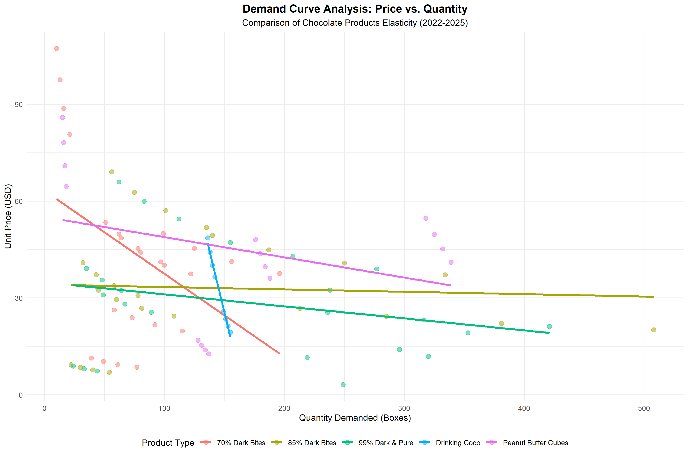

# liorgr-cell-ChocolateSales
Multi-year economic analysis of US chocolate sales (Kaggle) using SQL, R, and Excel. Focusing on price elasticity.
# 📊 US Chocolate Market Analysis: Price Elasticity of Demand

## 👤 About Me
Hi, I'm Lior, a first-year Economics undergraduate student at Ben-Gurion University of the Negev. I am passionate about data analysis, applying economic theories to real-world datasets, and translating raw numbers into actionable business insights.

## 🎯 Project Objective
The primary goal of this analysis was to take a broad dataset of global chocolate sales and extract meaningful data to understand the **Price Elasticity of Demand**. By doing so, I aimed to compare how consumers react to price changes across different types of chocolate relative to one another.

## 🌍 Scope and Focus
While the initial dataset contained a massive variety of chocolates across multiple countries, I strategically narrowed the focus to ensure a precise and relevant analysis:
* **Market:** United States (US) market only.
* **Products:** Selected 5 distinct categories to highlight contrasting elasticities:
  1. Drinking Coco
  2. 70% Dark Bites
  3. 85% Dark Bites
  4. 99% Dark & Pure
  5. Peanut Butter Cubes

## 🛠️ Data Processing & Methodology (SQL)
1. **Extraction & Cleaning:** I extracted the data from the main database using SQL. A critical step was identifying extreme outliers in unit prices. I refined and cleaned the data to significantly reduce price variance, ensuring a reliable foundation for elasticity modeling.
2. **Master Table Aggregation:** After cleaning and normalizing the individual product data, I merged all the processed datasets into a single, structured **Master Table** using `UNION ALL`. This streamlined the workflow for the visualization phase.

## 📈 Visualization (R & ggplot2)
Using R, I transitioned from the SQL Master Table to a clear visual representation of the demand curves. The graph is specifically designed to emphasize the differences in price elasticities between the products, visually distinguishing steep (inelastic) curves from shallow (elastic) ones.

## 💡 Key Conclusions
* **The "Normal Good" Behavior:** The analysis revealed a clear pattern: the more a product is perceived as a standard, "normal" daily good (e.g., Drinking Coco), the smaller the change in quantity demanded when prices increased. Consumers absorbed the price hikes with minimal drop in purchasing volume (Highly Inelastic).
* **Price Sensitivity:** Conversely, more specific or premium chocolates showed higher sensitivity, where price increases led to sharper drops in demand.

## 🧠 Real-World Deviations & The Snob Effect
While the visualization follows the fundamental Law of Demand, it's crucial as an economic analyst to acknowledge real-world behavioral deviations:
* **The Snob Effect:** In certain premium categories (like 99% Dark Chocolate), pure rational elasticity might not always apply. Markets can experience the "Snob Effect" (or Veblen-good behavior), where a higher price might occasionally *increase* or sustain demand because the high cost signals prestige, exclusivity, and status to a specific consumer niche.

## 🛠️ The Data Journey & Workflow

The raw dataset for this project was initially sourced from **Kaggle**. 
📂 [Click here to view the dataset file used in this project](./Chocolate_Sales.csv)

Below is a step-by-step breakdown of how the data was extracted, cleaned, and transformed for this economic analysis:

## Phase 1: Data Engineering & Simulation (SQL)
### Step 1: Isolating the US Market Data
The original Kaggle dataset contained sales records from multiple countries worldwide. To ensure the price elasticity model isn't skewed by foreign exchange rates or differing cultural consumption habits, my very first step was to filter the "noise" and extract only the data relevant to the **United States**.

```sql
-- Creating a dedicated working table strictly for the US market
CREATE TABLE USA_Chocolate_Sales AS
SELECT *
FROM Chocolate_Sales
WHERE Country = 'USA'; 
```

### Step 2: Data Standardization & Feature Engineering
Raw datasets often contain formatting that prevents immediate mathematical operations. Instead of overwriting the original raw data, I followed data integrity best practices by creating new, clean columns.

The original price column contained text characters (the $ sign), preventing numeric calculations. I used SQL string manipulation to strip this symbol and convert it to a precise numeric format.
```sql
-- Step 2a: Adding new columns to preserve the original raw data
ALTER TABLE USA_Chocolate_Sales
ADD Clean_Price REAL,
ADD Formatted_Date DATE;

-- Step 2b: Populating the new columns with standardized data
UPDATE USA_Chocolate_Sales
SET 
    -- Removing the '$' symbol and casting as a decimal
   Clean_Price = REPLACE(TRIM(Price), '$', '') ;
    
    -- Formatting the date to a standard SQL DATE structure
    "Formatted_Date" = 
    SUBSTR("Date", 7, 4) || '-' || 
    SUBSTR("Date", 4, 2) || '-' || 
    SUBSTR("Date", 1, 2);
```
### Step 3: Product Isolation & Feature Selection (Representative Example)
To accurately calculate price elasticity, I needed to analyze each product individually and focus only on the relevant data points.

Instead of pulling all available columns (SELECT *), I optimized the extraction by selecting only the specific variables strictly necessary for the elasticity modeling: Date, Price, Country, and Quantity. Below is the SQL snippet for Drinking Coco. This exact logic was replicated for the other four categories ( 70% Dark Bites, 85% Dark Bars, 99% Dark & Pure, and Peanut Butter Cubes).
```sql
-- Isolating specific columns for 'Drinking Coco' into a dedicated working table
CREATE TABLE USA_Drinking_Coco AS
SELECT 
    Formatted_Date,
    Clean_Price,
    Country,
    "Boxes Shipped"
FROM USA_Chocolate_Sales
WHERE Product = 'Drinking Coco';
```
### Step 4: Outlier Detection via Statistical Analysis
Before removing any data, I performed a statistical review of each product's price range to identify anomalies. By calculating the **Minimum**, **Maximum**, and **Average** prices, I was able to spot extreme values that were economically unrealistic.

For instance, in the **Drinking Coco** category, I noticed prices that were either near zero or exceptionally high compared to the mean, suggesting data entry errors or non-standard sales.
```sql
-- Step 4a: Analyzing price distribution to identify outliers
SELECT 
    MIN(Clean_Price) AS Min_Price,
    MAX(Clean_Price) AS Max_Price,
    AVG(Clean_Price) AS Avg_Price
FROM USA_Drinking_Coco;

-- Step 4b: Removing the identified outliers based on the analysis
-- (In this case, keeping prices between $2.00 and $45.00)
DELETE FROM USA_Drinking_Coco
WHERE Clean_Price > 45.00 
   OR Clean_Price < 2.00;
```
### Step 5: Longitudinal Data Expansion (Iterative Simulation)
Since the original dataset only provided a baseline for 2022, I expanded the data to cover a 4-year period (2022–2025). This was an **iterative process**, where each year’s data served as the foundation for the next, allowing for a logical progression of market trends.

I used an **INSERT INTO ... SELECT** approach to sequentially migrate and modify the data. The snippet below illustrates the **initial base transformation** used to generate the 2023 records from the 2022 baseline. This same logic was then applied progressively to create 2024 and 2025.

#### 📊 Economic Classification Logic:
I categorized the products to simulate realistic price and demand fluctuations over the four-year span:

| Product Type | Example | Economic Assumption | Simulation Logic |
| :--- | :--- | :--- | :--- |
| **Basic Necessity** | Drinking Coco | Inelastic demand; volume remains steady despite price changes. | 5% annual price growth; 3% volume decrease. |
| **Luxury Good** | 99% Dark Chocolate | Highly elastic demand; consumers are very sensitive to price hikes. | 10% annual price growth; 12% volume decrease. |
| **Neutral** | 70% Dark Chocolate | Moderate elasticity; follows standard inflation trends. | 7% annual price growth; 6% volume decrease. |

#### 💻 Implementation Example (Generating 2023 Base):
Below is the SQL logic used to "bootstrap" the 2023 data. I used string replacement for dates, applied a price multiplier, and adjusted volume using a `CAST` to integers to ensure realistic shipping units.
```sql
-- Iteratively generating 2023 data based on the 2022 foundation
INSERT INTO USA_Drinking_Coco (Formatted_Date, Clean_Price, Country, "Boxes Shipped")
SELECT
    REPLACE(Formatted_Date, '2022', '2023'), -- Shifting the time horizon
    Clean_Price * 1.05,                      -- Applying price growth coefficient
    Country,
    CAST("Boxes Shipped" * 0.97 AS INTEGER)  -- Adjusting volume based on elasticity
FROM USA_Drinking_Coco
WHERE Formatted_Date LIKE '%2022%';
```
---
<small>*This logic served as the foundation for the 2023 dataset. The same iterative process was then applied sequentially for 2024 and 2025 (Year n+1 based on Year n).*</small>

### Step 6: Dataset Consolidation (UNION ALL & Feature Injection)
After cleaning, simulating, and expanding the data across 5 separate working tables, the final SQL step was to consolidate everything into a single master dataset. This is essential for exporting the data into **R** for statistical analysis and visualization.

To ensure the statistical software could distinguish between the different items, I used a standard data engineering technique: **Dynamic Feature Injection**. During the `UNION ALL` operation, I hardcoded a new `Product` column into each `SELECT` statement, tagging every row with its respective category.
```sql
-- Consolidating all 5 tables into one final analytical dataset
CREATE TABLE Final_Chocolate_Master_USA AS
SELECT *, 'Drinking Coco' AS Product FROM USA_Drinking_Coco
UNION ALL
SELECT *, '85% Dark Bites' AS Product FROM Chocolate_85_Percent_USA
UNION ALL
SELECT *, 'Peanut Butter Cubes' AS Product FROM Peanut_Butter_Cube_USA
UNION ALL
SELECT *, '99% Dark & Pure' AS Product FROM Chocolate_99_pure_USA
UNION ALL
SELECT *, '70% Dark Bites' AS Product FROM Chocolate_70_Percent_USA;
```
---
<small>This step transformed the data into a "Tidy Data" (Long Format) structure, perfectly optimized for grouping and plotting in R using ggplot2.<small>

## Phase 2: Demand Curve Analysis & Visualization (R)
After preparing the consolidated dataset in SQL, I used R to perform the final economic analysis. The goal was to visualize the demand curves for all five chocolate products and compare their price elasticities over the 2022-2025 period.
```R
# Loading necessary libraries for analysis and visualization
library(ggplot2)
library(dplyr)

# Importing the final consolidated CSV file
chocolate_USA <- read.csv("Final_Chocolate_Master_USA.csv")

# Creating the Demand Curve Visualization
ggplot(chocolate_USA, aes(x = Boxes.Shipped, y = Clean_Price, color = Product)) +
  # Adding data points (observations) with transparency
  geom_point(alpha = 0.5, size = 2.5) +
  
  # Adding linear regression lines (Demand Curves) without confidence intervals
  geom_smooth(method = "lm", se = FALSE, linewidth = 1.2) +
  
  # Setting professional labels and titles
  labs(
    title = "Demand Curve Analysis: Price vs. Quantity",
    subtitle = "Comparison of Chocolate Products Elasticity (2022-2025)",
    x = "Quantity Demanded (Boxes)",
    y = "Unit Price (USD)",
    color = "Product Type"
  ) +
  
  # Clean, minimal theme with customized title alignment and legend position
  theme_minimal() +
  theme(
    plot.title = element_text(hjust = 0.5, face = "bold", size = 14),
    plot.subtitle = element_text(hjust = 0.5, size = 11),
    legend.position = "bottom"
  )

# Saving the final analysis as a high-resolution image for the report
ggsave("Demand_Analysis_Graph.png", width = 12, height = 8, dpi = 300)
```
### 📈 Demand Curve Visualization

---
## Conclusion & Business Impact
This project successfully bridged the gap between raw datasets and actionable economic insights. By utilizing **SQL** for robust data preparation and simulation, and **R** for precise statistical visualization, the workflow demonstrates how technical data processes feed directly into product analytics.

The final visualizations confirmed the theoretical elasticity of different chocolate categories. Understanding these dynamics—recognizing which products can sustain price hikes and which are highly sensitive—is crucial for making data-driven decisions regarding pricing strategies, market positioning, and revenue optimization.
